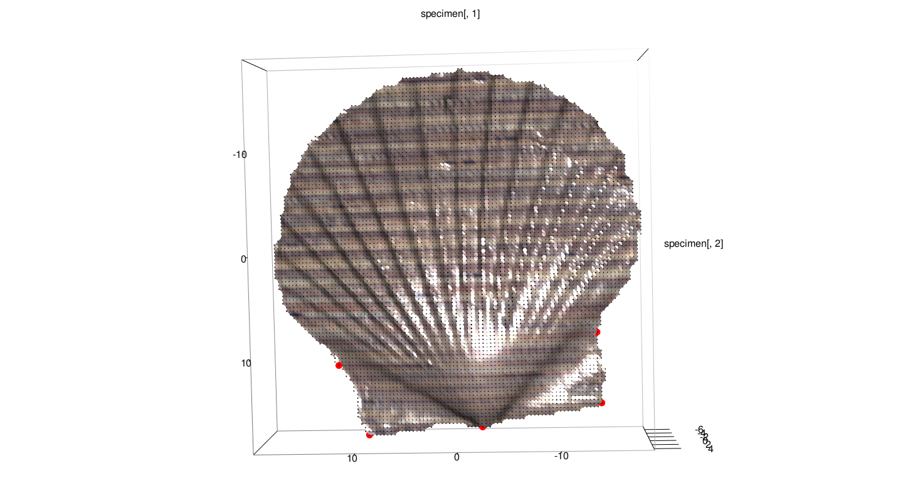
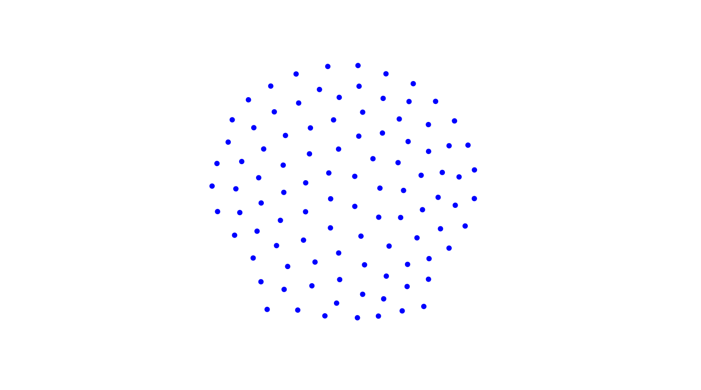

```{r setup, include=FALSE}
knitr::opts_chunk$set(echo = TRUE)
```


Below is an overview of the steps one needs to take in order to digitize fixed landmarks, and semilandmarks on surfaces, in *geomorph* using a 3D surface object or a mesh3d object. In its simplest version, this involves the following *geomorph* functions:

  1. `digit.fixed`
  2. `buildtemplate`
  3. `digitsurface`

**NOTE:** if one wishes to also use curve semilandmarks, these may be either digitized as fixed landmarks, and then indexed for sliding using the *curves* argument of `gpagen()`; or sampled automatically from a digitized curve using `digit.curves()`.   

---
## 1. Digitizing fixed landmarks
We will be using the scallop example ply file included in geomorph, so let´s load this first:

```{r eval=TRUE}
library(geomorph)
data("scallopPLY")
my.ply <- scallopPLY$ply
```


Let´s also make sure that our working directory is set to an adequate location. This is particularly relevant for 3D digitizing, as throughout the process, files with the digitized landmark coordinates, as well as the template we will create for replicating 3D surface semilandmarks across specimens, will be stored and automatically read in by functions. For this example, we will work in the subdirectory *~/example3D/*, so go ahead and make sure your working directory is set to a folder with that name.


Once a ply file is imported (usually using `read.ply`), one will first digitize the fixed landmarks using `digit.fixed()`. Note that this is an interactive function, so you will need to replicate these steps in your R console to be able to see the full version of this example. We will digitize 5 fixed landmarks.

```{r eval=FALSE}
fixed.lms1 <- digit.fixed(spec = my.ply, fixed = 5)
```

**PRACTICAL ADVICE:** Note that landmark selection on the 3dmesh is done by chosing the point of the scan closest to where you click with your mouse. This means that occasionally points may appear to "go through to the other side of the structure", especially if your initial point cloud is not very dense. To solve this issue, try rotating the structure to find a better view for digitizing, or zooming in such that you can click close to one of the scan points (these are visible as tiny grey points when you zoom in). 

Once you have completed the digitizing of the specimen, your digitizing device should look something like this:

```{r, echo = FALSE, out.width="80%"}
  
```

Now have a look at your working directory. A new file has been created, called my.ply.nts. This contains the coordinates of the digitized 3D fixed landmarks for your specimen.

Now let´s add a second specimen. For the example, we will just replicate the ply file of the first one, but with a different name. Go ahead and digitize the same five landmarks on this second specimen. A second nts file, called my.ply.2.nts is now created in your working directory.

```{r eval=FALSE}
my.ply.2 <- scallopPLY$ply
fixed.lms2 <- digit.fixed(my.ply.2, 5)
```

**NOTE:** If one wishes to continue and sample also surface semilandmarks, this step can be performed together with the acquisition of surface sliders (see below).

## 2. Sampling surface semilandmarks
### 2A: Building the template
Now that the fixed landmarks have been digitized, we can continue and sample surface sliding semilandmarks. We will use the first specimen as the reference from which to build a template, which will then be used to sample these semilandmarks across all specimens in our sample. This is done using the function `buildtemplate`. We will sample 100 surface semilandmarks. 

```{r eval=FALSE}
surf.pts1 <- buildtemplate(spec = my.ply, fixed = fixed.lms1, surface.sliders = 100)
```

*NOTE:* One may want to import fixed landmarks already digitized and saved as an nts file. This can be easily done using *readland.nts*, but remember that the input to the argument *fixed* above is a matrix, so you will need to combine that to *two.d.array* to obtain a 2d-matrix with the coordinates of the fixed landmarks.


When running `buildtemplate` you will see the sampled surface semilandmarks in an rgl device, which will look (3D rotations notwithstanding) more or less like this:

```{r, echo = FALSE, out.width="80%"}
  
```

Note that a txt file containing the coordinates of the sampled surface semilandmarks has been created in your working directory, with the name template.txt. Also, note that the file my.ply.nts has been modified, and it now contains the coordinates of the fixed landmarks AND surface semilandmarks. Finally, a csv file containing the index of sliding semilandmarks has been created, and can be read for use with the argument *surfaces* of `gpagen`.

**NOTE:** One may choose to perform steps 1. and 2. above at once for the reference specimen. In that case, the argument *fixed* of `buildtemplate` would indicate the number of fixed landmarks to be digitized (i.e. 5 in our example).

### 2B: Sampling surface semilandmarks in subsequent specimens
Now that the template has been created, we will use it to sample homologous surface semilandmarks in the second specimen in our sample. This is done using the function `digitsurface`.

```{r eval=FALSE}
surf.pts2 <- digitsurface(spec = my.ply.2, fixed = fixed.lms2)
```

Once the surface semilandmarks have been sampled, you will see a graph with their position in specimen 2.

```{r, echo = FALSE, out.width="80%"}
knitr::include_graphics("figs/example_spec2.png")  
```

As before, the file my.ply.2.nts has been modified, and it now contains the coordinates of the fixed landmarks AND surface semilandmarks for specimen 2. 

**NOTE:** Same as for building the template, one may choose to simultaneously digitize fixed landmarks and sample surface semilandmarks using the template.

## 3. Plotting 3D specimens
At any moment, you can plot a specimen together with fixed landmarks and surface sliding semilandmarks using `plotspec`.