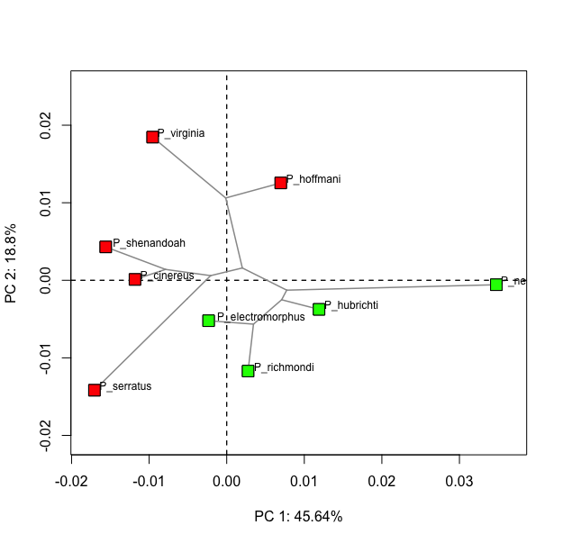
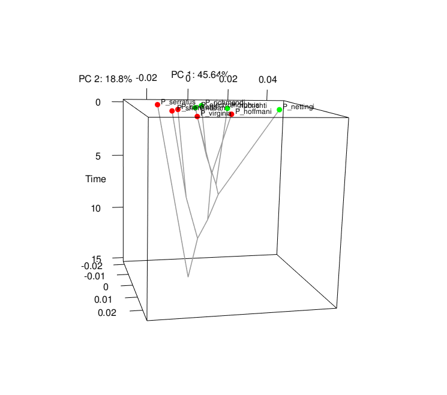

```{r setup, include=FALSE}
knitr::opts_chunk$set(echo = TRUE)
```


Since version 3.1.0 of geomorph, we have introduced the function `gm.prcomp`, and related utility functions (`summary()` and `plot()`), for performing principal components analyses on Procrustes shape variables for a set of aligned specimens. This function now includes several different types of analytical options and, combined with other visualization tools available in geomorph, provides tools for exploring variation in shape space. This vignette illustrates the analytical, plotting, and visualization capacities of `gm.prcomp` and other related functions.

**NOTE:** The combination of the functions and procedures illustrated here are meant to substitute and extend the options previously available through the functions `plotTangentSpace` and `plotGMPhyloMorphoSpace`, which are no longer maintained and have thus been deprecated. 

---
### Example dataset
Throughout, we will be using shape data of several *Plethodon* species as an example, so let´s first load and superimpose those.

```{r eval=TRUE}
library(geomorph)
data(plethspecies) 
Y.gpa <- gpagen(plethspecies$land, print.progress = F)
```

## 1. Traditional PCA and visualization of shape patterns
One first option is to perform a "traditional" PCA, i.e. based on OLS-centering and projection of the data, very much like what is performed in the basic R function `prcomp`. Note that this also corresponds to the analytical part of the old (now deprecated) geomorph function `plotTangentSpace`.

```{r eval=TRUE, fig.width = 6, fig.height = 6}
PCA <- gm.prcomp(Y.gpa$coords)
summary(PCA)
plot(PCA, main = "PCA")
```
 
Note that, by contrast to older functions, `gm.prcomp` provides a much higher flexibility of plotting options, by allowing to directly pass arguments to the `plot()` R-base function, e.g.: 

```{r eval=TRUE, fig.width = 6, fig.height = 6}
plot(PCA, main = "PCA", pch = 22, bg = "green", cex = 1.5, cex.lab = 1.5, font.lab = 2)
```

One then has several solutions for exploring shape variation across PC space and visualizing shape patterns. First, the user may choose to manually produce deformation grids to compare the shapes corresponding to the extremes of a chosen PC axis using `plotRefToTarget`, i.e.:

a) By comparing the minimum and maximum values to the global consensus:

```{r eval=TRUE, fig.width = 6, fig.height = 3}
msh <- mshape(Y.gpa$coords)
plotRefToTarget(PCA$shapes$shapes.comp1$min, msh)
plotRefToTarget(msh, PCA$shapes$shapes.comp1$max)
```

or b) by comparing the two extremes to each other:

```{r eval=TRUE, fig.width = 6, fig.height = 3}
plotRefToTarget(PCA$shapes$shapes.comp1$min, PCA$shapes$shapes.comp1$max, method = "vector", mag = 2)
```

Of course here one can use all the plotting options available in `plotRefToTarget`. Please see the help file of that function for details.

Alternatively, one may use the interactive function `picknplot.shape` to explore shape variation across the PC scatterplot produced above. This allows one to click on any point in the above scatterplot (or any scatterplot produced by geomorph) to obtain a deformation grid illustrating the shape that corresponds to the selected point, as compared to the global mean shape. The function then interactively prompts the user to export the grid as an image file, if desired, and to continue by picking another point. To explore the function, run the code below and then click at any point inside the PCA scatterplot:


```{r eval=FALSE}
picknplot.shape(plot(PCA), method = "vector")
```

Again, options of the function `plotRefToTarget` are directly available and can be passed to picknplot.shape as additional arguments.


## 2. Phylomorphospace
One may also want to project a phylogeny (if dealing with species-level observations), and estimated ancestral states into the ordination plot produced before, to obtain what is commonly referred to as a "phylomorphospace" plot (Klingenberg & Ekau 1996, Biol. J. Linn. Soc. 59: 143 - 177; Rohlf 2002, Geometric morphometrics and phylogeny. Pp. 175-193 in N. MacLeod, and P. L. Forey, eds. Morphology, shape and phylogeny. Francis & Taylor, London; Sidlauskas 2008, Evolution 62: 3135 - 3156). This can be easily done by providing a phylogenetic tree during the analysis (which is however **NOT** used in the analytical step in this case, other than for estimating ancestral states), and then indicating that the phylogeny should also be plotted during the plotting step. For the *Plethodon* example data, we may project the phylogeny into the previous ordination plot as such:

```{r eval=TRUE, fig.width = 6, fig.height = 6}
PCA.w.phylo <- gm.prcomp(Y.gpa$coords, phy = plethspecies$phy)
summary(PCA.w.phylo)
plot(PCA.w.phylo, phylo = TRUE, main = "PCA.w.phylo")
```

Note that the summary statistics obtained for this analysis are **identical** to those from the previous one. This is because here the phylogeny is merely used for plotting, and is **NOT** considered during the analytical procedures. 

Again, all plotting arguments can be directly manipulated by the user. Please see the help file of `plot.gm.prcomp` for details.

## 3. phyloPCA
Here, the phylogeny **IS** considered during the analytical step of the ordination, as the principal components analysis is in this case calculated based on GLS-centering and projection of the data. For details on the analytical part of this method, see Revell 2009, Evolution 63: 3258 - 3268; Polly et al 2013, Hystrix 24: 33 - 41; Collyer & Adams, submitted. 

For the *Plethodon* example data, this analysis would be implemented and plotted as follows (fir with untransformed residual projection and second with transformed residual projection):

```{r eval=TRUE, fig.width = 6, fig.height = 6}

# Phylo PCA without projecting untransformed residuals
phylo.PCA <- gm.prcomp(Y.gpa$coords, phy = plethspecies$phy, GLS = TRUE)
summary(phylo.PCA)
plot(phylo.PCA, phylo = TRUE, main = "phylo PCA")

```

```{r eval=TRUE, fig.width = 6, fig.height = 6}

# Phylo PCA without projecting transformed residuals
phylo.tPCA <- gm.prcomp(Y.gpa$coords, phy = plethspecies$phy, GLS = TRUE, transform = TRUE)
summary(phylo.tPCA)
plot(phylo.tPCA, phylo = TRUE, main = "phylo PCA with transformed projection")
par(mfrow = c(1, 1))

```

Again, one can use the geomorph functions `plotRefToTarget` or `picknplot.shape` to visualize variation on the produced ordination plot, as described for the case of the simple PCA above.

## 3. PaCA: Phylogenetically-aligned PCA

This recently introduced method (Collyer & Adams, submitted) provides an ordination that aligns phenotypic data with phylogenetic signal, by maximizing variation in directions that describe phylogenetic signal, while simultaneously preserving the the Euclidean distances among observations in the data space. PaCA provides a projection that shows the most phylogenetic signal in the first few components, irrespective of other signals in the data. By comparing PCA, phyloPCA and PaCA results, one may glean the relative importance of phylogenetic and other (ecological) signals in the data.

For the *Plethodon* example data, this analysis would be implemented and plotted as follows:

```{r eval=TRUE, fig.width = 6, fig.height = 6}
PaCA <- gm.prcomp(Y.gpa$coords, phy = plethspecies$phy, align.to.phy = TRUE)
summary(PaCA)
plot(PaCA, phylo = TRUE, main = "PaCA")
```

## 4. Three-dimensional PCA plot with a phylogeny and time on the z-axis
Finally, substituting the corresponding option previously available through `plotGMPhyloMorphoSpace`, plot.gm.prcomp provides the possibility of producing a 3D plot of any two PCA axes, with the phylogenetic tree connecting the observations and time on the z-axis. Again, different plotting parameters can be controlled to manipulate plot aesthetics. Note, that in this case an rgl plotting device will open for the 3D plot, but the corresponding biplot with the phylogeny projected (option 2, above) will also be produced.

```{r eval=FALSE}
plot(PCA.w.phylo, time.plot = TRUE, pch = 22, bg = c(rep("red", 5), rep("green", 4)), cex = 2, 
     phylo.par = list(edge.color = "grey60", edge.width = 1.5, tip.txt.cex = 0.75,
                      node.labels = F, anc.states = F))
 
```
```{r, echo = FALSE, out.width="40%"}
  
  
```


